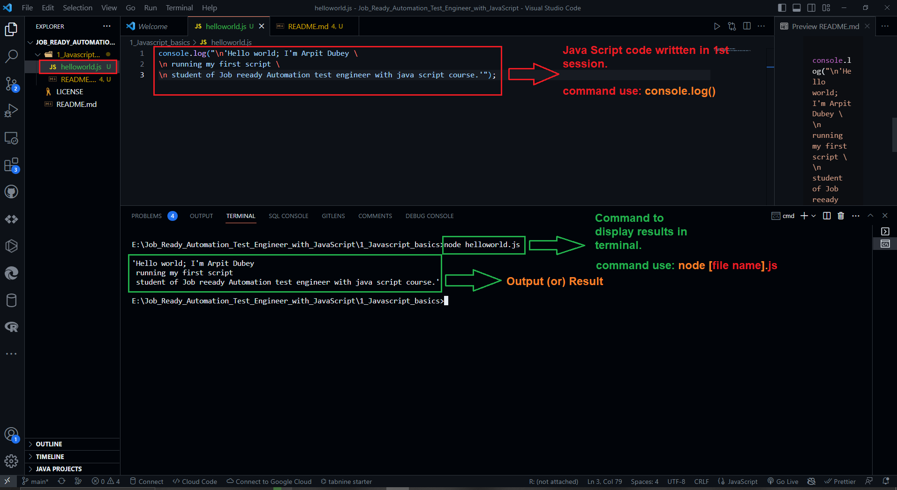
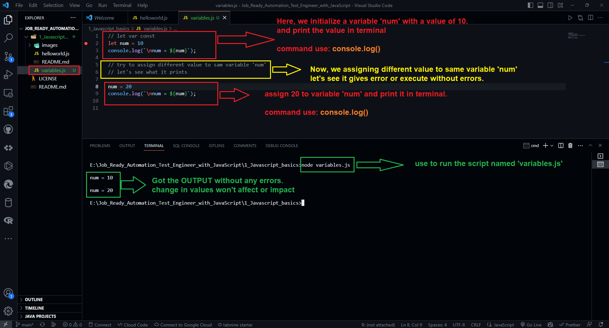
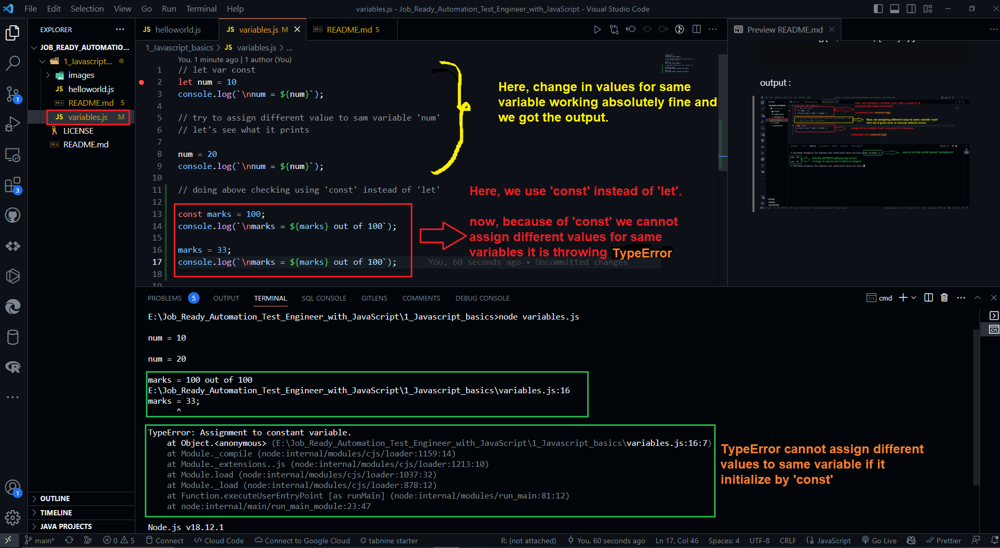
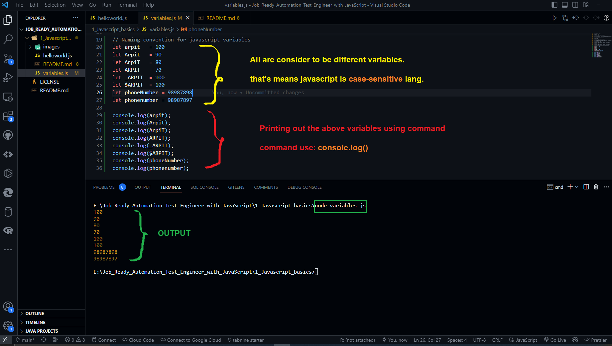

# Job Ready Automation Test Engineer with JavaScript


## Javascript Basics

- Using VS Code Editor, and node JS as server I'm running my first script in this course module.

file name: helloworld.js
```javascript

console.log("\n'Hello world; I'm Arpit Dubey \
\n running my first script \
\n student of Job reeady Automation test engineer with java script course.'");
```
output :



- Now, in 2nd script I'm checking does change in value for same variable affect (or) does any impact on the output (or) not?
It will throw an exception (or) error (or) not?

file name: variables.js
```javascript
// let var const
let num = 10
console.log(`\nnum = ${num}`);

// try to assign different value to sam variable 'num' 
// let's see what it prints

num = 20
console.log(`\nnum = ${num}`);

```

output :



- let's see the above checks using 'const' varibale instaed of using 'let' :

file name: variables.js
```javascript

// let var const
let num = 10
console.log(`\nnum = ${num}`);

// try to assign different value to sam variable 'num' 
// let's see what it prints

num = 20
console.log(`\nnum = ${num}`);

// doing above checking using 'const' instead of 'let'

const marks = 100;
console.log(`\nmarks = ${marks} out of 100`);

marks = 33;
console.log(`\nmarks = ${marks} out of 100`);

```

output :



- Java script is a CASE SENSITIVE scripting language. let's check it through variable names

- We can use '_' (underscore) and '$' (dollar sign) as special charcters in naming of a variable.

file name : variables.js
```javascript
// Naming convention for javascript variables
let arpit   = 100
let Arpit   = 90
let ArpiT   = 80
let ARPIT   = 70
let _ARPIT  = 100
let $ARPIT  = 100
let phoneNumber = 98987898
let phonenumber = 98987897

console.log(arpit);
console.log(Arpit);
console.log(ArpiT);
console.log(ARPIT);
console.log(_ARPIT);
console.log($ARPIT);
console.log(phoneNumber);
console.log(phonenumber);
```

output :
